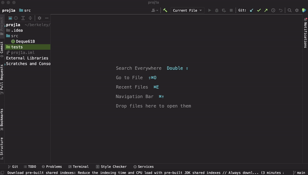

# 项目 1A：LinkedListDeque61B

!!! info "MOLI：本次实验你将会学到什么"
    在本项目中，你将实现一个基于链表的双端队列（LinkedListDeque），通过这个过程你将：
    
    - 深入理解链表数据结构，特别是双向链表的实现原理和应用
    - 掌握Java泛型编程，实现能存储任意类型数据的容器
    - 学习接口与实现分离的设计原则
    - 实践面向对象编程中的封装、抽象和多态特性
    - 理解并实现双端队列（Deque）这一抽象数据类型
    - 熟悉哨兵节点等设计模式，简化边界情况处理
    - 学习编写全面的单元测试，验证数据结构的正确性
    - 培养调试和问题分解能力，提升代码质量和可维护性

## [常见问题](https://sp25.datastructur.es/projects/proj1a/faq/)

每个作业都会在顶部提供一个 FAQ 链接。你也可以通过在网址末尾添加“/faq”来访问它。项目 1A 的 FAQ 位于[此处](https://sp25.datastructur.es/projects/proj1a/faq/)。

## 简介

在项目 0 中，你实现了 2048 游戏逻辑。在项目 1A 和 1B（以及一些后续实验）中，你要实现自己的数据结构！在项目 1 中，你会从创建自己的列表类结构开始：实现一种叫做双端队列（deque，发音为”deck”）的新抽象数据类型。

到项目 1A 结束时，你会…

- 理解数据结构中后备链表的使用方式

- 通过测试和测试驱动开发，获得验证自己数据结构正确性的经验

项目 1A 会提供大量代码框架，给出明确的步骤指引。项目 1B 则要完成类似任务，但框架会更少。

!!! TIP

    本节假设你已经观看了直到 DLList 讲座（第 5 讲）的所有课程内容。

!!! WARNING

    本项目必须 **独自完成** ！请仔细阅读[协作与作弊政策](https://sp25.datastructur.es/policies/#collaboration-and-academic-misconduct)了解具体要求。特别注意不要在网上查找答案。

    顺便说一句，你不能在实现中使用任何内置的 `java.util` 数据结构！重点就是自己动手实现！在极少数情况下，你可以在测试之外使用特定数据结构，我们会明确说明这些情况。

### 代码风格

本项目中，我们会严格执行代码风格要求。你必须遵守[样式指南](https://sp25.datastructur.es/resources/guides/style/)，否则会在自动评分器中被扣分。

你可以使用 CS 61B 插件在本地检查代码风格。**我们不会因为未检查风格而解除提交限制。**

**我们不会强制测试代码的风格，所以你可以使用魔数！**

### 获取框架代码

按照[作业流程指南](https://sp25.datastructur.es/resources/guides/assignment-workflow/#assignment-workflow)的说明获取框架代码并在 IntelliJ 中打开。本项目中，我们会在 `proj1a` 目录下工作。

你会看到仓库中出现一个 `proj1a` 目录，结构如下：

```txt
 proj1a
├── src
│   └── Deque61B.java
└── tests
    ├── LinkedListDeque61BTest.java
    └── PreconditionTest.java
```

如果遇到错误，请停下来仔细阅读[git 常见问题](https://sp25.datastructur.es/resources/guides/git/wtfs/)，或者去 OH 或 Ed 寻求帮助。相比随意尝试 git 命令，这能节省你大量时间。如果发现自己想用 Google 推荐的命令比如 `force push` ，[别这么做](https://twitter.com/heathercmiller/status/526770571728531456)。 **即使 Stack Overflow 上的帖子建议这么做，也别用 force push！**

你也可以看 Hug 教授的[演示](https://www.youtube.com/watch?v=tABtNcN5y0A)了解如何开始，遇到 git 问题时再看[这个视频](https://www.youtube.com/watch?v=Squ8TmG5mX0)。

## Deque61B: ADT 与 API

双端队列（deque）和我们课堂上讨论的 SLList 以及 AList 类非常相似。这是来自[Java 标准库](https://docs.oracle.com/en/java/javase/17/docs/api/java.base/java/util/Deque.html)的定义：

> 一种线性集合，支持在两端插入和删除元素。“deque”是“double ended
> queue”的缩写，通常发音为“deck”。大多数 `Deque` 实现对可容纳元素数量没有固定限制，但此接口也支持容量受限的双端队列以及无固定大小限制的队列。

我们不需要 Java 中 `Deque` 定义的所有方法。我们定义了自己的接口，可以在 `src/Deque61B.java` 中找到。

例如， `get` 方法的描述如下，这是一种称为* Javadoc 注释 *的格式：

```java
/** ...
 * @param index 要获取的索引
 * @return 返回deque中索引为{@code index}的元素
 */
T get(int index);
```

这里 `@param` 表示方法参数， `@return` 表示方法返回值。 `@code` 标签用于代码格式化。

如果你在 IntelliJ 中悬停在方法名上，会看到类似这样的弹窗，这对了解方法功能很有帮助：


!!! TASK

    首先打开 `Deque61B.java` 文件并 **阅读** 其中的文档说明。我们 **不会** 在规范中重复接口文件中的信息——所以必须确保在完成项目时 **仔细阅读** 这些内容。

!!! DANGER

    不要编辑 `Deque61B.java` 文件。

**其他方法的描述也需要你自己阅读。**

!!! DANGER

    **这非常重要。不要跳过这一步。如果你跳过了，会浪费数小时的时间。请为自己节省时间，减少自己的压力！**

## `LinkedListDeque61B`

### 项目设计理念

初学者常犯的错误是编写大量代码，然后希望全部功能都能正常工作。这对程序员的日常工作简直是场灾难。想象一下你实现了上述所有方法，提交给自动评分器，却收到类似”调用 `get` 返回了 9，预期是 7”的反馈。你根本不知道问题是出在 `get` 方法本身，还是其他必要方法出错了。

为了帮助大家培养更好的编程习惯，在 1A 项目中，我们会手把手引导你完成开发过程。虽然你不需要严格遵守推荐步骤（如果你通过了自动评分器就能获得全部分数），但我们强烈建议你遵循本规范中列出的步骤。

!!! TIP

    为了获得最佳体验，请按顺序执行这些步骤。如果你跳过这些步骤后寻求帮助，我们会要求你回到这些步骤。

### 创建文件

首先创建名为 `LinkedListDeque61B` 的文件。该文件应放在 `proj1a/src` 目录下。右键点击 `src` 目录，选择”New->Java Class”，然后将其命名为 `LinkedListDeque61B` 。

我们希望 `LinkedListDeque61B` 能够存储多种类型的数据。例如， `LinkedListDeque61B<String>` 存储 `String` 类型， `LinkedListDeque61B<Integer>` 存储 `Integer` 类型。为此，需要将类声明修改为：

```java
public class LinkedListDeque61B<T>
```

课堂上讲过，使用 `T` 或其他名称如 `LinkedListDeque61B<Glerp>` 实际上没有区别。但我们建议使用 `<T>` 以保持与其他 Java 代码的一致性。

我们还需要告诉 Java 每个 `LinkedListDeque61B` 都是一个 `Deque61B` ，这样用户就可以编写如 `Deque61B<String> lld1 = new LinkedListDeque61B<>();` 的代码。为此，需要将类声明修改为：

```java
public class LinkedListDeque61B<T> implements Deque61B<T>
```

这会引发错误。为了让 `LinkedListDeque61B` 成为 `Deque61B` ，它需要实现所有 `Deque61B` 的方法。当出现错误提示时，将鼠标悬停在红色波浪线下，点击弹出的错误消息框中的”implement
methods”按钮。这会自动为你生成方法头。

下图展示了这些步骤：



最后，你需要创建一个空的构造函数。在文件中添加以下代码，目前先保持构造函数体为空：

```java
public LinkedListDeque61B() {
}
```

注意：你也可以通过点击”Code”，然后选择”Generate”再选择”Constructor”来生成构造函数，但我们更推荐手动输入代码的方式。

现在你已经准备好开始了！

### JUnit 测试

#### `LinkedListDeque61BTest`

现在打开 `LinkedListDeque61BTest.java` 文件。你会看到每一行前面都有 `//` 注释。让我们删除除最后一行外的所有 `//` 注释。为此，选中所有以 `//` 开头的行。然后点击顶部菜单栏的”Code”，选择”Comment with Line Comment”。所有行现在应该被取消注释。你也可以使用快捷键：Windows/Linux 下是 `Ctrl+/` ，Mac 下是 `⌘ /` 或 `Cmd+/` 。

现在点击并运行所有测试。由于你尚未实现任何方法，这些测试几乎都会失败。

在通过这些测试之前，你需要完成大量工作，所以我们暂时搁置测试，稍后再回来处理。

#### `PreconditionTest`

在这个测试文件中，我们提供了一些测试用例，用于检查你的 `LinkedListDeque61B` 文件中的代码结构是否正确。你不需要完全理解这些测试，但需要能够运行它们。

### 编写并验证构造函数

!!! TASK

    本节假设你已完整观看并理解了到 **第 5 讲 DLList** 为止的所有课程。

“拓扑结构”是你用来表示链表的结构。尽管讲座中讨论了多种选择，但本项目 **要求** 实现一个带有哨兵节点的循环双链表拓扑结构：

空列表由一个指向自身的哨兵节点表示。仅有一个名为 `sentinel` 的实例变量指向该哨兵节点。[请参考此幻灯片](https://docs.google.com/presentation/d/10JSf8_Cut4kodFP3MxoPovUVjTGWZ6YFyIuT95NyqTk/edit#slide=id.g829fe3f43_0_376)。

如讲座中所述，虽然最后一种方法最初看起来最复杂，但最终会带来最简单的实现。

实现 `LinkedListDeque61B` 的构造函数以匹配相应的拓扑结构。

!!! TIP

    在实现过程中，你需要创建一个 `Node` 类并引入一个或多个实例变量。这可能需要一些时间来完全理解。

!!! DANGER

    你的 `Node` 类设计是 **严格要求** 。如果 `Node` 类未满足上述规范（如非内部类或字段不完整），你将无法通过自动评分器。

完成之后，在 `addFirstTestBasic` 的第一行设置断点。以调试模式运行测试，并使用 `Step Over`()功能。使用 Java 可视化工具验证你创建的对象是否符合预期的拓扑结构。

!!! TASK

    **任务** ：实现构造函数。你的 `LinkedListDeque61B` 构造函数 **必须** 不带参数。实现一个节点类。（你可能还需要一些实例变量。）

    ---

    如果 `PreconditionTest` 失败，说明你的实现存在某些不足。测试应该会给出错误提示。一些常见错误包括：

    - 你可能使用了错误的拓扑结构。（如果你遇到 `NullPointerException` ，这很可能是原因。）

    - `Node` 可能定义在单独的文件中。

    - `Node` 可能使用了错误的类型来存储数据。请记住 `Deque61B` 是泛型的。

    - `LinkedListDeque61B` 可能有带参数的构造函数。

    - 双链表节点的字段可能过少或过多。

    - 可能包含了非基本类型或非节点类型的字段。

    ---

    其他测试在你完成 `toList` 方法之前可能无法正常运行。

### 编写并验证 `toList` 方法

你可能已经发现，使用调试器和可视化工具验证 `addFirst` 和 `addLast` 方法的正确性既繁琐又令人不悦。此外，这种手动验证方式在你修改代码后很快就会失效。想象一下，你对 `addLast` 方法进行了细微但不确定的修改。为了验证是否破坏了现有功能，你不得不重新执行整个验证流程。这确实令人头疼。

（此外，我们有近 1500 名学生！我们不可能为每个人的作业重复这个过程。）

我们真正需要的是自动化测试。但可惜的是，如果仅实现了 `addFirst` 和 `addLast` 这两个方法，目前尚无简单的方法验证其正确性。换句话说，此时我们无法遍历链表并获取其值，也无法确认结果是否正确。

这就是 `toList` 方法的作用。当调用该方法时，它会返回 `Deque61B` 的列表表示形式。例如，如果 `Deque61B` 调用了 `addLast(5)` 、 `addLast(9)` 、 `addLast(10)` ，然后调用 `addFirst(3)` ，那么 `toList()` 的结果应是一个以 3 开头、接着是 5、9、10 的列表。在 Java 中打印时，会显示为 `[3, 5, 9, 10]` 。

编写 `toList` 方法。方法的第一行应类似 `List<T> returnList = new ArrayList<>()` 。 **这是唯一允许使用 Java 数据结构的场景。** 你可以通过 IntelliJ 的自动导入功能或复制以下语句来导入 `ArrayList` ：

```java
import java.util.ArrayList; // 导入 ArrayList 类
```

要验证你的 `toList` 方法是否正常工作，可以运行 `LinkedListDeque61BTest` 中的测试用例。如果所有测试通过，你就建立了坚实的基础，可以继续推进项目。太棒了！如果没有通过，使用调试器仔细检查，找出 `toList` 方法的问题。如果实在卡壳，可以回到之前的步骤，重新验证 `addFirst` 和 `addLast` 方法是否正常。

!!! TIP

    后续某些方法如果使用 `toList` 会变得简单。但你 **不能在 `LinkedListDeque61B` 内部调用 `toList`** ，我们有专门的测试用例检测这一点。

!!! TASK

    **任务** ：实现 `toList` 方法，并通过 `LinkedListDeque61BTest` 中的测试用例验证其正确性。

### 测试组件

在项目 0 中，我们提供了一套完整的单元测试用例供你本地测试。在本项目中，你需要编写自己的单元测试套件，以实现类似的覆盖率。为了让你了解其运作原理，我们会使用你的测试文件（ `LinkedListDeque61BTest.java` ）来“测试”我们的 `LinkedListDeque61B` 示例实现。通过某种自动评分器魔法，我们可以判断你的测试用例能够覆盖哪些边界情况，从而评估你的测试套件的“覆盖率”。因此，为了获得该部分的满分，你需要为每个方法尽可能思考所有可能的边界情况！

我们的示例实现仅包含一个无参构造函数，这意味着你的测试用例也 **只能使用无参构造函数** 。

!!! DANGER

    **分享测试用例被视为学术不端行为和作弊。请不要这样做。这是为了培养你的测试技能。**

### 编写测试用例

我们要使用 Google 的[Truth](https://truth.dev/)断言库编写测试用例。相比 JUnit 断言，我们选择使用该库的原因包括：

- 更清晰的列表断言失败信息。

- 更容易编写和阅读的测试用例。

- 开箱即用的更丰富的断言库。

我们通常使用 **Arrange-Act-Assert** 模式编写测试用例：

1.  **Arrange** （安排）测试用例，例如实例化数据结构或填充元素。

2.  **Act** （操作）执行要测试的行为。

3.  **Assert** （断言）验证操作结果。

在单个测试方法中，我们通常会包含多个“操作”和“断言”步骤，以减少重复代码（boilerplate
code）。

你应该在 `LinkedListDeque61BTest.java` 中编写测试用例。

!!! TIP

    **注意** ：在本项目中编写的测试用例会检查覆盖的不同“场景”。你需要覆盖足够多的场景，包括一些边界情况。

!!! WARNING

    **通过覆盖率检查并不代表你的测试用例是完美的！** 可能仍然存在未覆盖的边界情况，因为我们并不要求 100%覆盖率，也不可能测试每一个情况。我们建议你为失败的代码编写自己的测试用例，而不仅仅依赖覆盖率检查。

!!! DANGER

    虽然覆盖率检查可以衡量你对 deque 的 *操作程度* ，但它不会检查你对 deque 的 *断言内容* 。如果你发现某些自测用例未通过，而你认为已覆盖了相关场景，下一步可以考虑在自己的测试用例中添加更多的断言。例如验证每次调用的结果，或在每次调用后检查整个 deque 的状态，或验证其他 deque 方法的结果。

#### Truth 断言

Truth 断言的格式如下：

```java
assertThat(actual).isEqualTo(expected);
```

若需要为断言添加消息，可以使用：

```java
assertWithMessage("actual is not expected")
    .that(actual)
    .isEqualTo(expected);
```

根据 `actual` 的类型，我们可以使用其他断言方式。例如，如果 `actual` 是一个 `List` ，可以通过以下方式检查其内容而无需构造新 `List` ：

```java
assertThat(actualList)
    .containsExactly(0, 1, 2, 3)
    .inOrder();
```

如果有一个 `List` 或其他引用对象，可以使用：

```java
assertThat(actualList)
    .containsExactlyElementsIn(expected)  // `expected` 是一个 List
    .inOrder();
```

Truth 提供了多种断言，包括 `isNull` 和 `isNotNull` ；以及针对 `boolean` 值的 `isTrue` 和 `isFalse` 。IntelliJ 的自动补全功能通常会给出可用的断言建议。

!!! WARNING

    如果你没有进行任何断言，即使你的实现有错误，你的测试用例也会通过！例如，以下测试用例会通过，即使 `addFirst` 没有实际效果：

    ```java
    @Test
    public void noAssertionTest() {
        Deque61B<String> lld = new LinkedListDeque61B<>();
        lld.addFirst("front");
    }
    ```

    你还需要记住，断言 `boolean` 值时必须使用 `.isTrue()` 或 `.isFalse()` 。例如，以下测试用例会始终通过，即使 `isEmpty` 始终返回
    false！

    ```java
    @Test
    public void isEmptyTest() {
        Deque61B<String> lld = new LinkedListDeque61B<>();
        assertThat(lld.isEmpty());
    }
    ```

    上述测试的最后一条语句应为 `assertThat(lld.isEmpty()).isTrue();` 。

### 示例测试

让我们分析提供的 `addLastTestBasic` ：

```java
@Test
/** 在这个测试中，我们只使用一个 assertThat 语句。
  * 有时，添加额外断言语句的繁琐工作并不值得。 */
public void addLastTestBasic() {
    Deque61B<String> lld1 = new LinkedListDeque61B<>();

    lld1.addLast("front"); // 调用后预期: ["front"]
    lld1.addLast("middle"); // 调用后预期: ["front", "middle"]
    lld1.addLast("back"); // 调用后预期: ["front", "middle", "back"]
    assertThat(lld1.toList()).containsExactly("front", "middle", "back").inOrder();
}
```

- `@Test` 告诉 Java 这是一个测试方法，在运行测试时会被执行。

- **Arrange** : 我们创建一个新的 `Deque61B` ，并使用 `addLast` 添加 3
  个元素。

- **Act** :
  我们调用 `Deque61B` 的 `toList` 。这隐式依赖于前面的 `addLast` 调用。

- **Assert** : 我们使用 Truth 断言检查 `toList` 是否包含特定元素且顺序正确。

### 剩余方法

现在你需要测试并实现所有剩余方法。在本项目的后续部分中，我们将以一个比较高的层次描述建议步骤。我们 **强烈建议** 你按给出的顺序完成剩余步骤。尤其是， **在实现前先编写测试** 。这种做法称为“测试驱动开发”，能帮助你确保在动手前清楚方法的预期行为。

#### `isEmpty` 和 `size`

这两个方法必须在 **常数时间内** 完成。即，任一方法执行时间不应与 deque 中元素数量相关。

为 `isEmpty` 和 `size` 编写一个或多个测试。运行它们并验证测试失败。 **你的测试应验证超过一个有趣的情况** ，例如检查空列表和非空列表，或检查大小变化。

对于这些测试，你可以在 `assertThat` 语句中使用 `isTrue` 或 `isFalse` 方法。

你的测试可以是粒度极细的，例如 `testIsEmpty` 、 `testSizeZero` 、 `testSizeOne` ，也可以是粒度粗的，例如 `testSizeAndIsEmpty` 。具体选择由你决定。

!!! TASK

    **任务** ： **为 `isEmpty` 和 `size` 方法编写测试** ，并验证测试失败。然后实现这些方法。

#### `get`

为 `get` 方法编写测试。确保测试 `get` 接收无效参数的情况，例如当 `Deque61B` 只有 1 个元素时调用 `get(28723)` ，或负数索引。此时 `get` 应返回 `null` 。

`get` 必须使用迭代。

!!! TASK

    **任务** ： **在编写测试并验证测试失败后** ，实现 `get` 。

#### `getRecursive`

由于我们使用链表，可以尝试编写递归版本的 `get` 方法 `getRecursive` 。

将 `get` 方法的测试复制粘贴到新测试中，使它们完全相同，但调用 `getRecursive` （虽然可以通过更复杂的语法避免复制粘贴测试，但 Java 中传递函数的语法较为复杂，这里不展开）。

!!! TASK

    **任务** ： **在复制测试并验证测试失败后** ，实现 `getRecursive` 。

#### `removeFirst` 和 `removeLast`

最后，编写测试 `removeFirst` 和 `removeLast` 的行为，并确保测试失败。对于这些测试，你需要使用 `toList` ！可参考 `addFirstAndAddLastTest` 。

不要保留已不再存在于 deque 中的元素引用。程序在任意时刻使用的内存应与元素数量成比例。例如，若向 deque 添加 10,000 个元素，再删除 9,999 个，内存使用量应与只保留 1 个元素的 deque 相同，而非 10,000 个。别忘了 Java 垃圾回收器仅在对象没有引用时才会“删除”它们。

若 `Deque61B` 为空， `remove` 应返回 `null` 。

`removeFirst` 和 `removeLast` 不得使用循环或递归。与 `addFirst` 和 `addLast` 一样，这些操作必须是“常数时间”。更多信息请参阅“编写 `addFirst` 和 `addLast` ”部分。

!!! TASK

    **任务** ： **编写测试并验证测试失败后** ，实现 `removeFirst` 和 `removeLast` 。
<!-- 
### 提交到自动评分器

在编写本地测试并成功通过后，尝试提交到自动评分器。你可能部分通过或全部通过。

- 如果覆盖测试失败，说明你的本地测试未覆盖某些情况。[这里](https://sp25.datastructur.es/projects/proj1a/flags/)是你需要覆盖的测试用例列表。 -->

### 评分标准

本项目与 Project 0
类似，分为多个组件，每个组件必须完全正确才能获得分数。

1.  **空列表 (15%)** ：定义合法的 `Node` 类并正确实现构造函数。

2.  **添加 (25%)** ：正确实现 `addFirst` 、 `addLast` 和 `toList` 。

3.  **`isEmpty` 、 `size` (5%)** ：正确实现 `isEmpty` 和 `size` ，且添加方法正常工作。

4.  **`get` (5%)** ：正确实现 `get` 。

5.  **`getRecursive` (5%)** ：正确实现 `getRecursive` 。

6.  **移除 (25%)** ：正确实现 `removeFirst` 和 `removeLast` 。

7.  **集成 (10%)** ：通过随机调用所有方法的集成测试套件。

8.  **测试覆盖 (10%)** ：编写足够多的测试用例覆盖标志。

对于 **测试覆盖率** 这一项，我们会用你的测试与官方参考实现对比，检查覆盖了多少场景和边界情况。你可以为此部分获得部分分数。你可以通过[这里](https://sp25.datastructur.es/projects/proj1a/flags/)查看测试用例列表。

### 致谢

- 环形缓冲区示意图来自[Wikipedia](http://en.wikipedia.org/wiki/Circular_buffer)。

- 本课题改编自[Kevin Wayne 的 Guitar Heroine](http://nifty.stanford.edu/2012/wayne-guitar-heroine/)项目。
